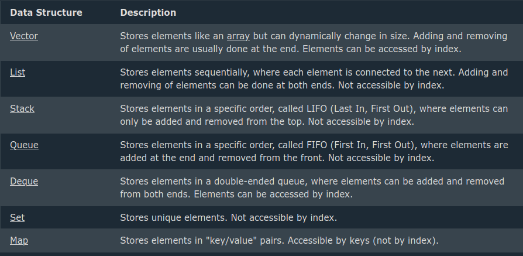

# Data Structures and STL



## Vectors

```c++
#include <vector>

vector<string> cars = {"Volvo", "BMW", "Ford", "Mazda"};

// Print vector elements
for (string car : cars) {
  cout << car << "\n";
}

cout << cars[0];  // Outputs Volvo

// Get the first element
cout << cars.front();

// Get the last element
cout << cars.back();


// Get the second element
cout << cars.at(1);

// Get the third element
cout << cars.at(2);

// Append
vector<string> cars = {"Volvo", "BMW", "Ford", "Mazda"};
cars.push_back("Tesla");

// Disable
vector<string> cars = {"Volvo", "BMW", "Ford", "Mazda"};
cars.pop_back();

// Empty
vector<string> cars;
cout << cars.empty();  // Outputs 1 (The vector is empty)

// Not Empty
vector<string> cars = {"Volvo", "BMW", "Ford", "Mazda"};
cout << cars.empty();  // Outputs 0 (not empty)
```

## List

```c++
#include <list>

// Create a list called cars that will store strings
list<string> cars = {"Volvo", "BMW", "Ford", "Mazda"};

// Print list elements
for (string car : cars) {
  cout << car << "\n";
}
```

```c++
// Create a list called cars that will store strings
list<string> cars = {"Volvo", "BMW", "Ford", "Mazda"};

// Get the first element
cout << cars.front();  // Outputs Volvo

// Get the last element
cout << cars.back();  // Outputs Mazda


list<string> cars = {"Volvo", "BMW", "Ford", "Mazda"};

// Add an element at the beginning
cars.push_front("Tesla");

// Add an element at the end
cars.push_back("VW");
```

### To Remove use pop_back and pop_front


```c++
list<string> cars = {"Volvo", "BMW", "Ford", "Mazda"};
cout << cars.size();  // Outputs 4
```

```c++
list<string> cars;
cout << cars.empty();  // Outputs 1 (The list is empty)
```


## Stacks (Last In, First Out)

```c++
#include <stack>

stack<string> cars = {"Volvo", "BMW", "Ford", "Mazda"}; 
```

```c++
// Create a stack of strings called cars
stack<string> cars;

// Add elements to the stack
cars.push("Volvo");
cars.push("BMW");
cars.push("Ford");
cars.push("Mazda");
```

```c++
// Change the value of the top element
cars.top() = "Tesla";

 // Access the top element
cout << cars.top();  // Now outputs "Tesla" instead of "Mazda"
```

```c++
// Create a stack of strings called cars
stack<string> cars;

// Add elements to the stack
cars.push("Volvo");
cars.push("BMW");
cars.push("Ford");
cars.push("Mazda");

// Remove the last added element (Mazda)
cars.pop();

// Access the top element (Now Ford)
cout << cars.top();

cout << cars.size();
```

```c++
stack<string> cars;
cout << cars.empty(); // Outputs 1 (The stack is empty)
```

## Queue (First in, First Out)

```c++
queue<string> cars = {"Volvo", "BMW", "Ford", "Mazda"};
```

```c++
// Create a queue of strings
queue<string> cars;

// Add elements to the queue
cars.push("Volvo");
cars.push("BMW");
cars.push("Ford");
cars.push("Mazda");
```
Volvo (front (first) element)
BMW
Ford
Mazda (back (last) element) 

```c++
// Access the front element (first and oldest)
cout << cars.front();  // Outputs "Volvo"

// Access the back element (last and newest)
cout << cars.back();  // Outputs "Mazda"
```

```c++
// Change the value of the front element
cars.front() = "Tesla";

// Change the value of the back element
cars.back() = "VW";

// Access the front element
cout << cars.front();  // Now outputs "Tesla" instead of "Volvo"

// Access the back element
cout << cars.back();  // Now outputs "VW" instead of "Mazda"

// Remove the front element (Volvo)
cars.pop();

//Get the size of a queue
cout << cars.size();

queue<string> cars;
cout << cars.empty(); // Outputs 1 (The queue is empty)
```

## Deque (stands for double-ended queue)

```c++
// Create a deque called cars that will store strings
deque<string> cars = {"Volvo", "BMW", "Ford", "Mazda"};

// Print deque elements
for (string car : cars) {
  cout << car << "\n";
}
```

Exactly like a vector but with front and back acces. It¡s like a vector with the acces of a list.

## Sets

- Are sorted automatically in ascending order.
- Are unique, meaning equal or duplicate values are ignored.
- Can be added or removed, but the value of an existing element cannot be changed.
- Cannot be accessed by index numbers, because the order is based on sorting and not indexing.

```c++
// Create a set called cars that will store strings
set<string> cars = {"Volvo", "BMW", "Ford", "Mazda"};

// Print set elements
for (string car : cars) {
  cout << car << "\n";
}
```
Output:

BMW
Ford
Mazda
Volvo

```c++
// Create a set called numbers that will store integers
set<int> numbers = {1, 7, 3, 2, 5, 9};

// Print set elements
for (int num : numbers) {
  cout << num << "\n";
}
```

```c++
// Sort elements in a set in descending order
set<int, greater<int>> numbers = {1, 7, 3, 2, 5, 9};
// Print the elements
for (int num : numbers) {
  cout << num << "\n";
}
```

```c++
 set<string> cars = {"Volvo", "BMW", "Ford", "BMW", "Mazda"};

// Print set elements
for (string car : cars) {
  cout << car << "\n";
}
```

```c++
set<string> cars = {"Volvo", "BMW", "Ford", "Mazda"};

// Add new elements
cars.insert("Tesla");
cars.insert("VW");
cars.insert("Toyota");
cars.insert("Audi");

 set<string> cars = {"Volvo", "BMW", "Ford", "Mazda"};

// Remove elements
cars.erase("Volvo");
cars.erase("Mazda");


set<string> cars = {"Volvo", "BMW", "Ford", "Mazda"};

// Remove all elements
cars.clear();

set<string> cars = {"Volvo", "BMW", "Ford", "Mazda"};
cout << cars.size();  // Outputs 4

set<string> cars;
cout << cars.empty();  // Outputs 1 (The set is empty)
```

## Map (Python Dictionary but automatically sorted by keys)

```c++
// Create a map that will store the name and age of different people
map<string, int> people = { {"John", 32}, {"Adele", 45}, {"Bo", 29} }; 

// Get the value associated with the key "John"
cout << "John is: " << people["John"] << "\n";

// Get the value associated with the key "Adele"
cout << "Adele is: " << people["Adele"] << "\n";

 // Get the value associated with the key "Adele"
cout << "Adele is: " << people.at("Adele") << "\n";

// Get the value associated with the key "Bo"
cout << "Bo is: " << people.at("Bo") << "\n";
```

To insert:
```c++
people["Jenny"] = 22;
people["Liam"] = 24;
people["Kasper"] = 20;
people["Anja"] = 30;
```

```c++
people.insert({"Jenny", 22});
people.insert({"Liam", 24});
people.insert({"Kasper", 20});
people.insert({"Anja", 30});
```


To remove:
```c++
 map<string, int> people = { {"John", 32}, {"Adele", 45}, {"Bo", 29} };

// Remove an element by key
people.erase("John");

people.clear();
```

Size and Empty:

```c++
map<string, int> people = { {"John", 32}, {"Adele", 45}, {"Bo", 29} };
cout << people.size(); 
```

```c++
map<string, int> people;
cout << people.empty(); // Outputs 1 (The map is empty)
```

Count (Checks if an element exists):

```c++
 map<string, int> people = { {"John", 32}, {"Adele", 45}, {"Bo", 29} };
cout << people.count("John");  // Outputs 1 (John exists)
```

Loop Through:

```c++
map<string, int> people = { {"John", 32}, {"Adele", 45}, {"Bo", 29} };

for (auto person : people) {
  cout << person.first << " is: " << person.second << "\n";
}
```

```c++
map<string, int, greater<string>> people = { {"John", 32}, {"Adele", 45}, {"Bo", 29} };

for (auto person : people) {
  cout << person.first << " is: " << person.second << "\n";
}
```

## Iterators

Iterators are like an auxiliar vector that points to the directions of the value and then it can acces the variable, erase it , change it or get the value by deference.

```c++
// Create a vector called cars that will store strings
vector<string> cars = {"Volvo", "BMW", "Ford", "Mazda"};

// Loop through vector elements
for (auto it = cars.begin(); it != cars.end(); ) {
  if (*it == "BMW") {
    it = cars.erase(it); // Remove the BMW element
  } else {
    ++it;
  }
}

// Print vector elements
for (const string& car : cars) {
  cout << car << "\n";
}
```

Iterate in reverse order:
```c++
// Iterate in reverse order
for (auto it = cars.rbegin(); it != cars.rend(); ++it) {
  cout << *it << "\n";
}
```

Stacks and queues do not support iterators.


## Algorithms

Sort a vector:

```c++
 #include <iostream>
#include <vector>
#include <algorithm>  // Include the <algorithm> library
using namespace std;

int main() {
  // Create a vector called cars that will store strings
  vector<string> cars = {"Volvo", "BMW", "Ford", "Mazda"};

  // Sort cars in alphabetical order
  sort(cars.begin(), cars.end());

  // Print cars in alphabetical order
  for (string car : cars) {
    cout << car << "\n";
  }

  return 0;
}
```

Sorting a vector of int:

```c++
#include <iostream>
#include <vector>
#include <algorithm>
using namespace std;

int main() {
  // Create a vector called numbers that will store integers
  vector<int> numbers = {1, 7, 3, 5, 9, 2};

  // Sort numbers numerically
  sort(numbers.begin(), numbers.end());

  for (int num : numbers) {
    cout << num << "\n";
  }

  return 0;
}

```

## C++ Algorithms Library

### Searching Algorithms:

- Find()

```c++

// Create a vector called numbers that will store integers
vector<int> numbers = {1, 7, 3, 5, 9, 2};

// Search for the number 3
auto it = find(numbers.begin(), numbers.end(), 3);
```

- upper_bound(), (Find the first value greater than)

```c++
// Create a vector called numbers that will store integers
vector<int> numbers = {1, 7, 3, 5, 9, 2};

// Sort the vector in ascending order
sort(numbers.begin(), numbers.end());

// Find the first value that is greater than 5 in the sorted vector
auto it = upper_bound(numbers.begin(), numbers.end(), 5);
```

- min_element()

```c++
// Create a vector called numbers that will store integers
vector<int> numbers = {1, 7, 3, 5, 9, 2};

// Find the smallest number
auto it = min_element(numbers.begin(), numbers.end()); 
```

- max_element()

```c++
// Create a vector called numbers that will store integers
vector<int> numbers = {1, 7, 3, 5, 9, 2};

// Find the largest number
auto it = max_element(numbers.begin(), numbers.end()); 
```

### Modifying Algorithms

- Copy()

```c++
// Create a vector called numbers that will store integers
vector<int> numbers = {1, 7, 3, 5, 9, 2};

// Create a vector called copiedNumbers that should store 6 integers
vector<int> copiedNumbers(6);

// Copy elements from numbers to copiedNumbers
copy(numbers.begin(), numbers.end(), copiedNumbers.begin()); 
```

- Fill()

```c++
// Create a vector called numbers that will store 6 integers
vector<int> numbers(6);

// Fill all elements in the numbers vector with the value 35
fill(numbers.begin(), numbers.end(), 35); 
```


